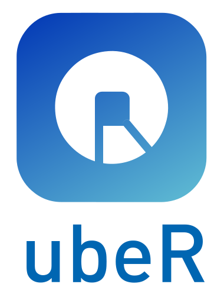

# Installation

You should first install the development version of the `httr` package.
```
devtools::install_github("hadley/httr")
```
Then go ahead and install the ubeR package.
```
devtools::install_github("DataWookie/ubeR")
```

# Uber Application Setup

1. Go to https://developer.uber.com/dashboard/create.
2. Select Rides API and fill out the Name and Description details.
3. Press Create.
4. In Authorisations tab:
    - Set Redirect URL to http://localhost:1410/
    - Insert a Privary Policy URL.
    - Check the required scopes under General Scopes.
    - Press Save.

## Uber Endpoints

Details of the various endpoints offered by the Uber API can be found [here](https://developer.uber.com/docs/rides).

These endpoints have already been implemented:

GET /v1/products
GET /v1/products/{product_id}
GET /v1/estimates/price
GET /v1/estimates/time
GET /v1.2/history
GET /v1.1/history
POST /v1/requests
GET /v1/requests/current
DELETE /v1/requests/current
GET /v1/payment-methods
GET /v1/places/{place_id}
PUT /v1/places/{place_id}

The following endpoints still need to be managed:

PATCH /v1/requests/current
GET /v1/requests/{request_id}
PATCH /v1/requests/{request_id}
DELETE /v1/requests/{request_id}
GET /v1/requests/{request_id}/map
GET /v1/requests/{request_id}/receipt
POST /v1/reminders
GET /v1/reminders/{reminder_id}
PATCH /v1/reminders/{reminder_id}
DELETE /v1/reminders/{reminder_id

To create an authorisation token, go to https://developer.uber.com/dashboard/.
